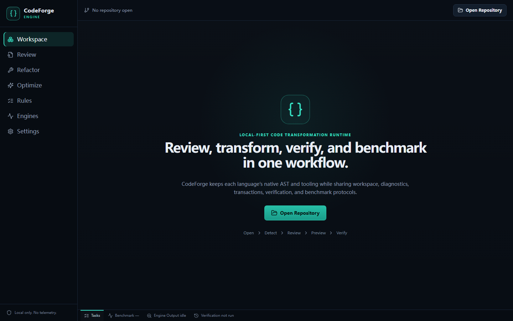

<p align="center">
  
</p>

<h1 align="center">CodeForge Engine</h1>

<p align="center"><strong>Local-first, verification-driven, language-aware code transformation runtime.</strong></p>

<p align="center">
  <a href="LICENSE"></a>
  
  
</p>



CodeForge is not a unified cross-language AST and not a GUI wrapper around six linters. It is a shared protocol and execution runtime for workspaces, diagnostics, transformations, verification, benchmarks, transactions, and engine adapters. Each language keeps its native grammar, tooling, and semantics.

CodeForge can review one workspace or orchestrate verified transformations across a repository fleet. Fleet runs keep one independent transaction per repository and emit evidence for every change.

The current `v0.2.0` is a verification-driven repository fleet refactoring preview. It ships a desktop workbench, CLI, fleet configuration and scheduler, built-in adapters for the original six language families plus Dart/Flutter, PowerShell, Markdown, and configuration formats, transactional preview/apply/undo, evidence bundles, SARIF, structured external-process execution, local tool discovery, and verification/benchmark pipelines. Optional tools are discovered from the local machine and degrade to `unavailable` when missing.

## Core capabilities

- Workspace indexing with Git-aware changed-file selection.
- Hot/warm/cold execution model with cancellation, debouncing, priority, timeout, and concurrency limits.
- Unified `Diagnostic`, `Fix`, `Transformation`, `VerificationResult`, `BenchmarkResult`, `TaskRecord`, and `EngineMetadata` contracts.
- Tree-sitter parsing and built-in heuristic rules across code, documentation, and configuration adapters.
- Preview-first transformations. Every edit produces a unified patch and persistent undo history.
- Sandbox optimization flow: candidates are applied to a temporary workspace, verified, and benchmarked there before a user can apply anything.
- Structured process execution with explicit executable paths and argument arrays. No shell interpolation.
- SARIF 2.1.0 export from unified diagnostics.
- Local-only defaults: no telemetry, no source upload, no cloud dependency, AI disabled.
- Repository fleet configuration, independent repository transactions, partial-success reporting, and per-repository evidence bundles.

## Supported languages

| Language | Parse | Review | Safe fixes | Transformation preview | Verification | Benchmark |
|---|---:|---:|---:|---:|---:|---:|
| Python | Yes | Built-in | `None` identity, bare `except` | Yes | pytest when available | Configured command |
| Rust | Yes | Built-in | `len() == 0` → `is_empty()` | Yes | Cargo check/test | Cargo bench |
| C | Yes | Built-in | Empty-string checks (review required) | Yes | Optional CMake/config | Configured command |
| JavaScript | Yes | Built-in | `var`, loose equality (review required) | Yes | package scripts | package `bench` |
| TypeScript | Yes | Built-in | Loose equality (review required) | Yes | package scripts | package `bench` |
| Java | Yes | Built-in | String literal equality (review required) | Yes | Maven/Gradle tests | Configured command |
| Go | Yes | Built-in | `strings.Index(...) >= 0` → `strings.Contains` | Yes | `go test ./...` | `go test -bench` |
| Dart / Flutter | Yes | Heuristic + Tree-sitter | Parse/review/format in v0.2 | Experimental | `dart analyze`, `flutter test` | Configured command |
| PowerShell | Yes | Heuristic + Tree-sitter | Parse/review/format when available | Review only | `pwsh` syntax, PSScriptAnalyzer when available | Configured command |
| Markdown / JSON / YAML / TOML / HTML / CSS | Structural review | Built-in checks | Format/lint through local adapters | Preview only | Adapter-dependent | Configured command |

External engines are not bundled. CodeForge discovers local executables such as Ruff, Clippy, clang-tidy, Oxlint, Maven/Gradle, Staticcheck, and ast-grep. A missing backend does not prevent the workspace from opening.

## Architecture

```text
Desktop UI / CLI
       │
       ▼
  codeforge-core
       │
       ├── workspace + Git
       ├── scheduler + cancellation
       ├── engine registry
       ├── diagnostics aggregator
       ├── transaction manager
       ├── verification pipeline
       ├── benchmark runner
       └── plugin manifests
              │
              ├── Python adapter
              ├── Rust adapter
              ├── C adapter
              ├── JavaScript / TypeScript adapter
              ├── Java worker adapter
              └── Go adapter
```

Key Rust crates:

| Crate | Responsibility |
|---|---|
| `codeforge-protocol` | Stable JSON contracts and SARIF mapping |
| `codeforge-workspace` | Indexing, hashing, markers, language detection |
| `codeforge-scheduler` | Priority queue, timeout, cancellation, debouncing |
| `codeforge-diagnostics` | Deduplication, severity normalization, source merging |
| `codeforge-transform` | Preview, unified diff, apply, rollback, persistent undo |
| `codeforge-verification` | Structured process execution and verification stages |
| `codeforge-benchmark` | Real timing samples, median, variance, delta |
| `codeforge-plugin` | Declarative manifests and permission checks |
| `codeforge-git` | Branch, changed files, staged/unstaged, diff ranges |
| `codeforge-engines` | Native Tree-sitter adapters and local tool discovery |
| `codeforge-fleet` | Fleet configuration, discovery, scheduling, policy, PR mode, evidence bundles |
| `codeforge-core` | Shared orchestration used by CLI and desktop |

See [architecture.md](docs/architecture.md) for the execution model and data flow.

## Verification model

CodeForge distinguishes evidence levels instead of calling every passing test a proof:

```text
Unverified, Heuristic, Compiled, Tested, Benchmarked, Verified
```

- `Heuristic`: a parser or rule produced a finding; semantics are not guaranteed.
- `Compiled`: a build/typecheck command passed.
- `Tested`: the configured test command passed.
- `Benchmarked`: real before/after timing samples were collected; this is not semantic equivalence.
- `Verified`: an equivalence/formal verifier passed for the exact transformation.
- Benchmark percentages are displayed only when real before/after timing samples exist.

## Installation

### CLI from source

```bash
cargo install --path crates/codeforge-cli
codeforge scan .
codeforge review . --json
codeforge review . --sarif > codeforge.sarif
```

### Desktop

```bash
cd apps/desktop
pnpm install
pnpm tauri build
```

Windows bundles `.msi` and NSIS `.exe`; Linux bundles `.AppImage` and `.deb` in the release workflow.

## CLI

```bash
codeforge scan .
codeforge lint . --changed
codeforge review . --language rust --engine clippy
codeforge refactor .
codeforge optimize .
codeforge verify .
codeforge benchmark . --samples 5
codeforge beautify .
codeforge ci --changed --sarif codeforge.sarif
codeforge fleet audit --config fleet.toml
codeforge fleet refactor --config fleet.toml --risk low --dry-run
```

Common flags:

```text
--json
--sarif
--changed
--language <name>
--engine <id-or-name>
--external
```

## Development

```bash
cargo fmt --all -- --check
cargo clippy --workspace --all-targets --all-features -- -D warnings
cargo test --workspace --lib --bins --tests
cargo build --release -p codeforge-cli

cd apps/desktop
pnpm install
pnpm lint
pnpm typecheck
pnpm build
pnpm tauri build --no-bundle
```

Local optional tools do not need to be installed to run the built-in fixture suite.

## Configuration

Create `.codeforge.toml` in the workspace when a project needs explicit commands:

```toml
[commands.test]
program = "cargo"
args = ["test", "--all-targets"]
cwd = "."
timeout_secs = 300

[commands.benchmark]
program = "cargo"
args = ["bench", "--quiet"]
cwd = "."
timeout_secs = 600
```

Supported command keys are `format`, `lint`, `syntax`, `typecheck`, `build`, `test`, `fuzz`, `differential`, `equivalence`, and `benchmark`. `format` and `lint` take precedence over auto-detected syntax/typecheck commands.

For fleet selection and policy, create `fleet.toml` and see [fleet-mode.md](docs/fleet-mode.md). Repository execution remains in `.codeforge.toml`.

## Plugin development

Plugins are declarative first. A manifest declares identity, languages, capabilities, executable, dependencies, timeout, and permissions:

```toml
id = "example-engine"
name = "Example Engine"
version = "0.2.0"
kind = "local_executable"
languages = ["python"]
capabilities = ["lint", "fix"]
executable = "example-tool"
timeout_ms = 30000
permissions = ["read_workspace", "execute_process"]
```

Arbitrary third-party plugins do not receive unrestricted shell or filesystem access by default. See [plugin-system.md](docs/plugin-system.md).

## Roadmap

- Current: fleet orchestration, safe transformation classes, verification evidence bundles, and PR mode.
- Next: incremental Tree-sitter caching, hunk-level review, and more language-native transforms.
- Future: worker SDK, differential verification, and formal verification.

## Benchmarking

The repository includes a Criterion suite for startup, repository indexing, single-file analysis, incremental review, AST search, and diagnostic aggregation. Run:

```bash
cargo bench -p codeforge-core --bench runtime
cargo bench -p codeforge-fleet --bench fleet
```

Do not publish claims such as “10x faster” without measured data in [benchmarks/results](benchmarks/results).

## AI boundary

AI is disabled by default. If an optional AI provider is added later, it may
only propose transformations. It cannot bypass the parser, diff, verification,
transaction, or policy boundaries. AI is optional proposal generation, not the
trust boundary.

See [rule-ids.md](docs/rule-ids.md) for the stable rule namespace.

## License

Apache-2.0. Third-party tools are locally discovered and are not relicensed or redistributed by this project. See [THIRD_PARTY_LICENSES.md](THIRD_PARTY_LICENSES.md).
